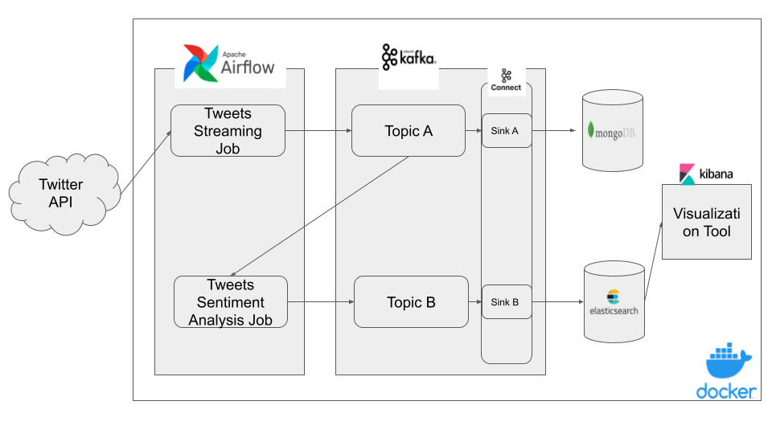

# Pipeliner

My simple project to learn data engineering

## Architecture



## How to run it in local

1. Run the Script `manage.sh` - wrapper for `docker-compose` works as a managing tool.

    - Build project infrastructure
    ```sh
    ./manage.sh up
    ```

    - Stop project infrastructure
    ```sh
    ./manage.sh stop
    ```

    - Delete project infrastructure
    ```sh
    ./manage.sh down
    ```